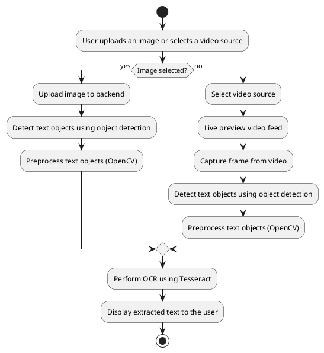
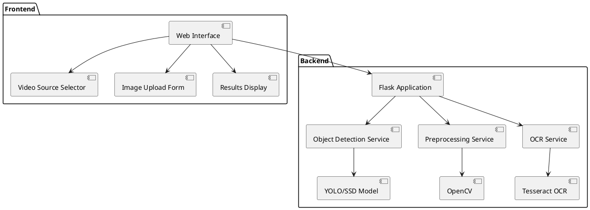

## AI Tools Inventory Manager

## **Project Proposal**

### **Project Name:**
**Dockerized OCR & Image Detection on Live Stream**  
**Date: 02/12/2024**

---

## **Introduction**

This document outlines the objectives, features, user stories, and workflows for the OCR and Text Recognition System. The goal is to provide a web-based application for object detection and OCR processing. This document serves as an agreement between the freelancer and the client to confirm that the features, functions, and interfaces comply with the client's requirements.

---

## **Project Objectives**

1. Provide a web-based application for object detection and OCR (Optical Character Recognition).  
2. Enable users to upload images or capture frames from live video feeds for text recognition.  
3. Apply object detection to detect text objects, preprocess them, and perform OCR to return detected text (AI-based text correction is **not included** in this project).  
4. Offer a user-friendly interface with video source selection, playback controls, and results display.

---

## **Project Scope**

### **Core Features**

#### **1. Image Upload OCR**
- Upload an image file for OCR processing.
- Detect and extract text objects using object detection.
- Preprocess detected text objects and perform OCR on them.

#### **2. Video Integration**
- Select video sources (e.g., webcams or external devices).  
- Live preview of selected video feed.  
- Capture a frame from the video feed for OCR processing.

#### **3. Object Detection and Preprocessing**
- Detect text objects in uploaded images or captured frames.  
- Preprocess detected text objects using OpenCV (e.g., resizing, thresholding, noise reduction).

#### **4. Responsive Web Interface**
- HTML-based user interface using Ninja templates.  
- Interactive controls for video playback, image upload, and OCR processing.  

---

## **User Stories**

### **1. Object Detection**
- **As a user**, I want to upload an image file so that I can detect all text objects in the image.  
- **Acceptance Criteria**:
  - The application should process the uploaded image and return a list of cropped images containing detected text objects.
  - The cropped images should be preprocessed using OpenCV before OCR.

---

### **2. Image OCR**
- **As a user**, I want to upload an image file so that I can extract text from the image.  
- **Acceptance Criteria**:
  - The application should process the uploaded image and return detected text.  
  - Text objects should be preprocessed before performing OCR.

---

### **3. Video OCR**
- **As a user**, I want to select a video source and capture frames for text recognition.  
- **Acceptance Criteria**:
  - The application should list all available video sources.  
  - The selected video feed should be displayed in real-time.  
  - Captured frames should be processed for OCR, and results should be displayed below the video.

---

### **4. AI Text Correction**
- **As a user**, I want to see corrected OCR text so that errors in recognition are minimized (optional).  
- **Acceptance Criteria**:
  - The AI model should refine the detected text.  
  - The corrected text should be displayed alongside the original OCR text.  
  - **Note**: AI text correction is **not included** in this project.  

---

## **Workflow Diagrams**

### **1. High-Level Workflow**

The high-level workflow of the project includes the following steps:  
1. User uploads an image or selects a video source.  
2. The backend processes the image or captured video frame.  
3. Detect text objects using object detection and preprocess them.  
4. Perform OCR on the preprocessed text objects using Tesseract.  
5. Display the results to the user.  

---

### **PlantUML Diagram: High-Level Workflow**

Below is the PlantUML source code for the high-level workflow diagram:



---

### **2. Component Diagram**

This diagram illustrates the architecture of the system, including web interface, backend, and services.

---

### **PlantUML Diagram: Component Diagram**

Below is the PlantUML source code for the component diagram:



---

## **Features and Interfaces**

### **Web Interface**
1. **Image Upload**:
   - Upload an image file for OCR processing via a file input form.  
   - Display results (detected text) below the upload form.

2. **Video Source and Playback**:
   - Dropdown menu to select video sources (e.g., webcams).  
   - Live preview of the selected video feed.  
   - Capture button to grab a frame from the video feed for OCR processing.

3. **Results Display**:
   - Display OCR results dynamically after processing.

---

## **Backend Functions**

### **1. `/` (GET)**
- **Purpose**: Serve the web interface.  
- **Response**: Renders the `index.html` template.

---

### **2. `/process` (POST)**
- **Purpose**: Process an uploaded image file for OCR.  
- **Input**: Image file.  
- **Output**:
  ```json
  {
    "text_objects": [
        "Text object 1 content",
        "Text object 2 content"
    ]
  }
  ```

---

### **3. `/capture` (POST)**
- **Purpose**: Process a captured frame from the video feed for OCR.  
- **Input**: Base64-encoded image.  
- **Output**:
  ```json
  {
    "text_objects": [
        "Text object 1 content",
        "Text object 2 content"
    ]
  }
  ```

---

## **Deliverables**

1. **Functional Features**:
   - Image upload OCR with object detection and preprocessing.  
   - Video source selection and frame capture for OCR.  

2. **Web Interface**:
   - Responsive design with Ninja templates.  
   - Video playback controls and results display.

3. **Backend Services**:
   - Flask application integrating object detection, preprocessing, and OCR using Tesse~ract.

4. **Dockerized Deployment**:
   - Dockerfile for containerized deployment.  
   - Instructions for running the application locally or in a container.

---

## **Acceptance Criteria**

1. The web interface should allow users to upload images and process them for OCR.  
2. The video integration should enable live preview and frame capture for OCR processing.  
3. Results (detected text) should be displayed dynamically on the interface.  
4. The project should be containerized and deployable using Docker.

---

## **Next Steps**

1. Review this document and confirm the outlined features and workflows.  
2. Provide feedback or additional requirements (if any).  
3. Upon confirmation, proceed with implementation and testing.

---

## **Feedback Section**

| **Feature/Functionality**       | **Compliant (Yes/No)** | **Comments**                  |
|----------------------------------|------------------------|--------------------------------|
| Image Upload OCR                |                        |                                |
| Video Source and Capture         |                        |                                |
| Object Detection and Preprocessing |                        |                                |
| Web Interface Design            |                        |                                |
| Dockerized Deployment           |                        |                                |

---

This document ensures all modified features and requirements are captured accurately. Let me know if further refinements are needed! 🚀